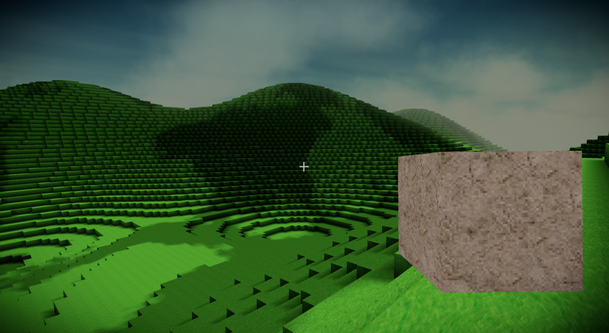

# Tutorial - Minimal Engine Demo

This tutorial module is rather a "showcase" of a minimal playable setup.
It builds upon the very basics of the [world generation tutorial](https://github.com/Terasology/TutorialWorldGeneration) and the [entity-component-system tutorial](https://github.com/Terasology/TutorialEntitySystem).

The player will spawn in a world of rolling green hills, where they can walk around and dig some blocks.
The last item picked up is the one which can be placed - simple as that.



## Blocks

Every game mode in Terasology needs to define (or reuse) blocks.
For this minimal demo we make use of the _auto-block_ feature by just placing block tiles in `assets/blockTiles/auto`.
The asset system will take these `.png` files and automatically create blocks with the same name for us.

```
assets/
└── blockTiles
    └── auto
        ├── dirt.png
        └── grass.png
```

The blocks are registered with a resource URN that's prefixed with the module name:

```
"TutorialMinimalEngineDemo:dirt"
```

Learn more about the [asset system](https://github.com/Terasology/TutorialAssetSystem/wiki).

## World Generation

The world generation used in this module is very simple.
Basically, it follows the first steps of the world generation tutorial by providing the minimal required set of building blocks to create a world.

```
src/main/java/org/terasology/tutorial/minimalenginedemo/world/
├── BuilderWorldGenerator.java
├── BuilderWorldRasterizer.java
└── SurfaceProvider.java
```

The surface provider determines the height of our world, e.g., where mountains and valleys are, by sampling a noise function.
The world rasterizer is responsible for turning this surface information into blocks.
The top-most layer is covered with grass, while all blocks below are dirt.
In the generator class these pieces are put together and given a name, such that players can select the world generator in game.

Learn more about [world generation](https://github.com/Terasology/TutorialWorldGeneration/wiki).

## Single-slot Inventory

Finally, a _single-slot inventory_ is added to the game by letting the player own the last block they have picked up.
This is achieved by introducing a new _component_ denoting the ownership of an item, and a system handling the event to give the player an item.

```
src/main/java/org/terasology/tutorial/minimalenginedemo/logic
├── CharacterOwnedItemComponent.java
└── HeldItemSystem.java
```

Learn more about the [entity-component system](https://github.com/Terasology/TutorialEntitySystem/wiki).
